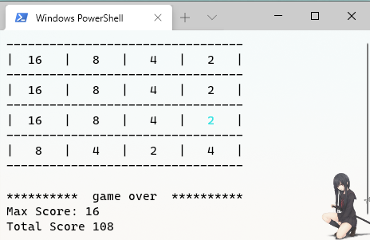

## 2048

A cli implementation of 2048 game learned from [chhabraamit](https://github.com/chhabraamit/2048). 

I didn't fork it because I wanted to code it step by step from scratch. Some  details have been adjusted.

## Getting started

 `go run main.go`
